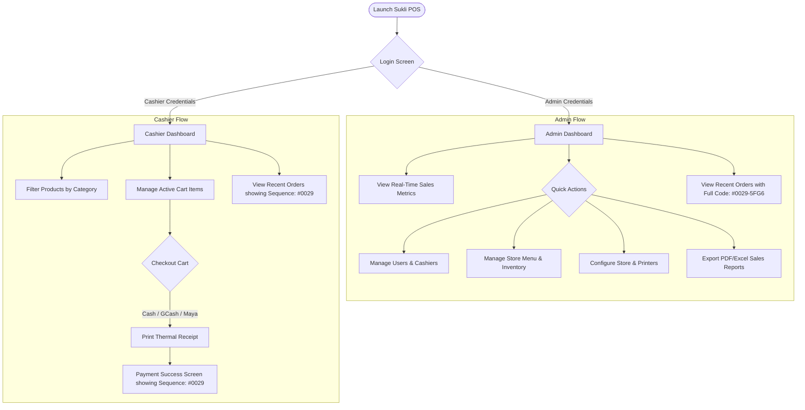

# Sukli POS 📱🏪

Offline-first Point-of-Sale (POS) system tailored for Philippine Micro, Small, and Medium Enterprises (MSMEs). Sukli POS works completely offline in areas with spotty internet connectivity and automatically synchronizes all transactions to the cloud when online.

---

### Tech Stack & Tools


---

## 🌟 Key Features

*   **Offline-First Architecture**: Powered by **Isar Database**, the app runs 100% offline. Purchases, menu updates, and cashier reports can be processed without an active internet connection.
*   **Automatic Cloud Synchronization**: Powered by **Supabase**. Sync queue manager detects network status changes via `connectivity_plus` and pushes queued changes when an active connection is restored.
*   **Role-Based Access Control**: Separate dashboard experiences for **Admin** and **Cashier** roles.
*   **Menu & Inventory Management**: Manage categories, item details, stock counts, and upload store logos.
*   **Sales Reports (PDF & Excel)**: Generate complete sales reports. Excel files feature interactive charts (Pie chart for payment breakdown, clustered column chart for revenue by cashier) using Syncfusion.
*   **Receipt Printing**: Built-in printer service for thermal receipt printer integration.

---

## 🔄 User Flow



### 1. Cashier Userflow
1.  **Login**: Cashier enters credentials.
2.  **Dashboard**: Sees the product catalog, category filters, and an active cart panel.
3.  **Cart Management**: Adds items to the cart, edits quantities, or deletes items.
4.  **Checkout**: Enters payment amount and selects payment method (Cash, GCash, or Maya).
5.  **Success**: Sees the success screen with the sequence order number (e.g. `#0029`). If configured, a physical thermal receipt is printed.
6.  **Recent Orders**: Cashier can view their recent transaction history showing sequence numbers (e.g. `#0029`).

### 2. Admin Userflow
1.  **Login**: Administrator enters credentials.
2.  **Dashboard**: Sees daily sales summaries, total transaction counts, pending sync items, and quick action grids.
3.  **Activity Monitoring**: Monitors recent activity showing full order numbers combined with cashier unique codes (e.g. `#0029-5FG6`) for tracking transaction origin.
4.  **Management Console**: Admin accesses quick links to manage users, add/edit menu items, and customize store printer profiles.
5.  **Analytics & Reports**: Admin generates sales reports for custom dates and downloads them as PDF or Excel files with pre-rendered data charts.

---

## 🛠️ Architecture & Project Structure

The project uses a structured **Feature-First** architecture combined with **Riverpod** for robust state management.

```
lib/
  ├── core/                # Global configurations, services (sync, printer), constants
  ├── shared/              # Reusable UI widgets, global state providers, Isar schemas
  └── features/
        ├── auth/          # Login, roles, session management
        ├── checkout/      # Product catalogs, cart logic, payment screens
        ├── dashboard/     # Role-based screens (Admin vs. Cashier)
        ├── menu/          # Product and category forms & management
        ├── orders/        # Order history lists and details
        ├── reports/       # Excel and PDF exporters, reports screen
        ├── settings/      # Store settings, receipt uploader
        └── void_refund/   # Void and refund processing screens
```

---

---

## 📄 Copyright & License

Copyright © 2026 Sukli POS. All rights reserved.
