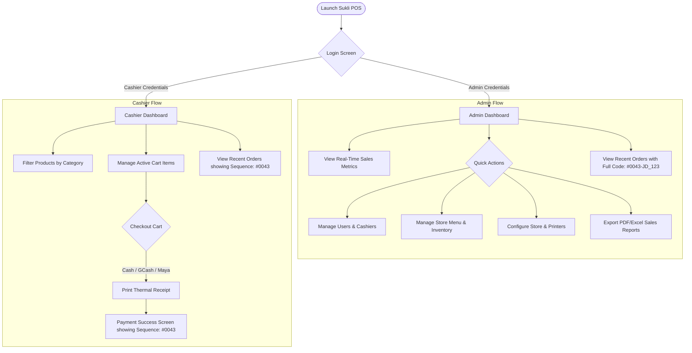

# Sukli POS 📱🏪

Offline-first Point-of-Sale (POS) system tailored for Philippine Micro, Small, and Medium Enterprises (MSMEs). Sukli POS works completely offline in areas with spotty internet connectivity and automatically synchronizes all transactions to the cloud when online.

---

### Tech Stack & Tools


---

## 🌟 Key Features

* **Offline-First Architecture**: Powered by **Isar Database**, the app runs 100% offline. Purchases, menu updates, and cashier reports can be processed without an active internet connection.
* **Automatic Cloud Synchronization**: Powered by **Supabase**. Sync queue manager detects network status changes via `connectivity_plus` and pushes queued changes when an active connection is restored.
* **Role-Based Access Control**: Separate dashboard experiences for **Admin** and **Cashier** roles with PIN/password login.
* **Menu & Inventory Management**: Manage categories, item details, stock counts, variants, modifiers, and store branding.
* **Bluetooth Thermal Receipt Printing**: Full ESC/POS thermal printing support over Bluetooth:
  - **Codepage Character Sanitizer**: Automatic text sanitization converts `₱` $\rightarrow$ `P`, smart quotes, dashes, and strips non-printable characters to prevent thermal printer crashes on emojis (`😊`).
  - **100% Customizable Layout**: Toggle store header, store address, contact number, date & time, cashier name, short order ID, footer messages, paper size (58mm/80mm roll), and hardware auto-cut commands.
  - **Paper-Saving Compact Design**: Optimized compact height and streamlined section dividers save 30%–50% paper on every print job.
* **Sales Reports (PDF & Excel)**: Generate complete sales reports. Excel files feature pre-rendered chart visualizations using Syncfusion.
* **Void & Refund Workflows**: Cashier and admin authorization workflows for item voids and transaction refunds.

---

## 🚀 Getting Started

### Prerequisites

- [Flutter SDK](https://docs.flutter.dev/get-started/install) (v3.19.0 or higher)
- Android SDK (API level 21+) / Android Studio or VS Code
- A [Supabase](https://supabase.com) project instance

### Required Environment Variables

Create a `.env` file in the root of `sukli_pos` (or configure `lib/core/constants/supabase_constants.dart`):

```env
SUPABASE_URL=https://your-supabase-project.supabase.co
SUPABASE_ANON_KEY=your-supabase-anon-key
```

### Local Setup & Installation

1. **Clone the Repository**:
   ```bash
   git clone https://github.com/tsugumii21/Sukli_POS.git
   cd Sukli_POS/sukli_pos
   ```

2. **Install Dependencies**:
   ```bash
   flutter pub get
   ```

3. **Run Code Generation** (for Isar & Riverpod providers if needed):
   ```bash
   dart run build_runner build --delete-conflicting-outputs
   ```

4. **Run the App**:
   ```bash
   # Connect an Android device or launch an emulator
   flutter run
   ```

5. **Run Automated Tests**:
   ```bash
   flutter test
   ```

---

## 🔄 User Flow


```mermaid
graph TD
    Start([Launch Sukli POS]) --> Auth{Login Screen}
    Auth -->|Admin Credentials| AdminDash[Admin Dashboard]
    Auth -->|Cashier Credentials| CashierDash[Cashier Dashboard]
    
    subgraph Admin Flow
        AdminDash --> SalesMetrics[View Real-Time Sales Metrics]
        AdminDash --> QuickActions{Quick Actions}
        QuickActions --> Users[Manage Users & Cashiers]
        QuickActions --> Menu[Manage Store Menu & Inventory]
        QuickActions --> Settings[Configure Store & Printers]
        QuickActions --> Reports[Export PDF/Excel Sales Reports]
        AdminDash --> RecentActAdmin[View Recent Orders with Full Code: #0043-JD_123]
    end
    
    subgraph Cashier Flow
        CashierDash --> CategoryFilter[Filter Products by Category]
        CashierDash --> CartManage[Manage Active Cart Items]
        CartManage --> Checkout{Checkout Cart}
        Checkout -->|Cash / GCash / Maya| ReceiptPrint[Print Thermal Receipt]
        ReceiptPrint --> SuccessScreen[Payment Success Screen showing Sequence: #0043]
        CashierDash --> RecentActCashier[View Recent Orders showing Sequence: #0043]
    end
```

---

## 🛠️ Architecture & Project Structure

The project follows a **Feature-First** architecture combined with **Riverpod** for robust, reactive state management.

```
lib/
  ├── core/                # Global configurations, services (sync, printer), constants
  ├── shared/              # Reusable UI widgets, global state providers, Isar schemas
  └── features/
        ├── auth/          # Login, roles, session management
        ├── checkout/      # Product catalogs, cart logic, payment screens
        ├── dashboard/     # Role-based screens (Admin vs. Cashier)
        ├── menu/          # Product and category forms & management
        ├── orders/        # Order history lists and details
        ├── reports/       # Excel and PDF exporters, reports screen
        ├── settings/      # Store settings, receipt customizer, Bluetooth printer setup
        └── void_refund/   # Void and refund processing screens
```

---

## 📄 Copyright & License

Copyright © 2026 Sukli POS. All rights reserved.  
Developed for Philippine Micro, Small, and Medium Enterprises (MSMEs).
